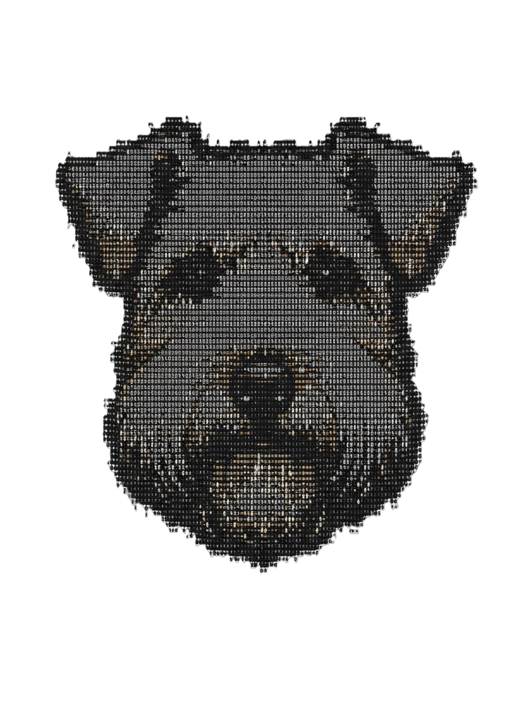

<p align="center">
  
</p>

# Enya

Real-time Embeddable Observability -- Built by developers for developers.

```rust
// Vision - Plug and play observability for your application.
#[tokio::main]
async fn main() -> Result<()> {
    // Integrates with metrics-rs and tracing opentelemetry.
    enya::serve("0.0.0.0:3000");

    Ok(())
}
```

**Core**

- Metrics compatible with Prometheus (metrics-rs)
- Logs compatible with Opentelemetry (tracing-subscriber)
- Memory profiling (rust-jemalloc-pprof)
- CPU Flamegraph Profiling (?)
- Git-awareness - Track things over commits
  - suitable for statefulsets +

**Other SDKs**

- DataFusion Customized  (More customized tracking helping teams)
  - Enable enya feature in DataFusion and make it integrate
- Deterministic Simulation Testing (Visualization)
  - egui graphs or step visualizer
- AI Agents ???

## Design goals

1. Reliable (Don't break users other system)
2. Compact (Highly embeddable)
3. Efficiency (Ingestion, Querying and Visualization)

## Tech

### Ui

To enable a true embedded solution -- egui for WASM and axum to serve it.

vs. gpui for Native desktop envs only..

- egui
- eframe
- egui_tiles

Design goals:

- High performance -- no lag (if we lag then we have failed)
- Compact and suitable for embedded and edge environments.

### Metrics Store

Time series LSM-based storage based on talna(fjall) and uwheel for indexing.

Design goals:

- Reliable and efficient
- Compatible with DataDog / Prometheus based language
- Non-interfering

### Log Store

Loki-like Log store for full-text search powered by Tantivy.

Design goals:

- Reliable and efficient.
- Support efficient fetching of tracings and logs

## Game Plan

- [ ] enya 0.1.0
  - [ ] metrics integration with Prometheus
  - [ ] memory profiling with rust-jemalloc-pprof

## Enterprise models

- Everything open-source (lib + UI).
- Open-core - Open source core + basic UI where more powerful UI is available at enya.dev/ or locked behind API key.
  - Tiers: Individual, Teams, Pro
  - Free: Metrics, Logs, CPU, Memory
  - Paid: Git Tracking for above, Historical data.

## Interesting crates

- ddsketch
- gpui / egui
  - gpui - More native feeling - Requires download
    - Zed backed
  - egui - Native + WASM -- Simplify connection to an instance.
    - Rerun backed
- talna
- uwheel
- Tantivy
- rkyv / zerocopy / zerovec
- Websocket <-> ui
